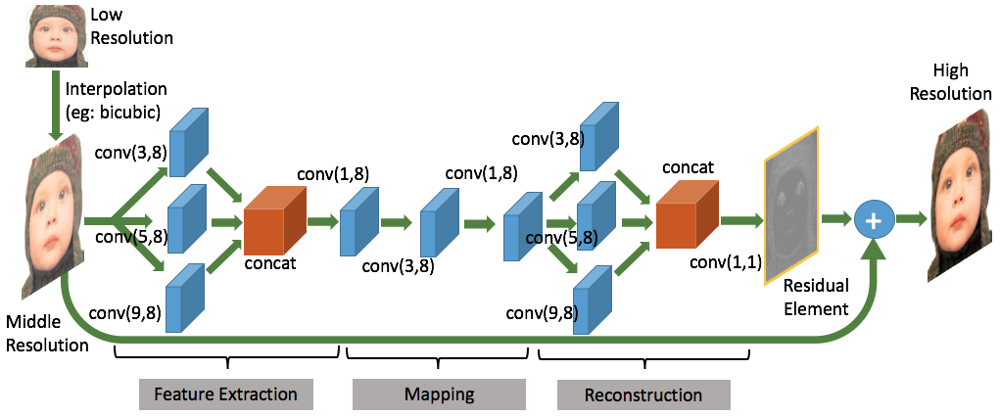
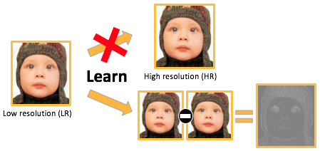
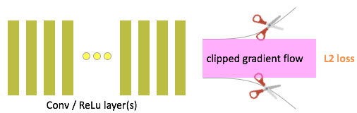
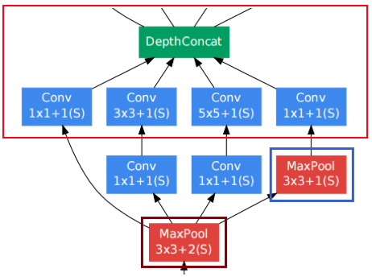

# Deep Residual Learning Super-resolution(深層)
ハリスさんの学位論文(博士論文のDRLSRのクソ(下平による)和訳)
## Chap.5 Deep Residual Learnig Super-resolution
### 5.1 イントロダクション
様々な種類の画像がインターネット技術により利用可能になったことで画像特徴を深く学習するアルゴリズムは大きなチャンスを得た。このチャンスは多くの研究者によって開拓され続けていおり、それは学習ベースのロバストな超解像(SR)アルゴリズムを開発するためだ。SRの主な目的は入力低解像LR画像から、高解像HR画像を構成できるように、高周波成分を復元する事である。
その他の目的はコンピュータヴィジョンタスクのアキュラシーを向上させるためである。
SRアルゴリズムは許容できる品質と解像度で入力RLから再構築される事が期待される。

現在、学習方法はLRからHRパッチへのマップするために広く使われている。スパース表現を用いたSRはその流行性を見せる、これは画像の意味的情報を自然に符号化しているためである。代表的なサンプルを集めることで、過完備な辞書を作成するために、入力画像の符号化符号化の為の正確な基底(basis)を発見することが可能になる。この研究はYangらやZrydeらが辞書の単一のペアを使うことに焦点を当てた。しかしながら、直感的に単一ペアの辞書を用いることは多くの冗長性を生む可能性があり、この冗長性により画像再構築プロセス中に不安定性を招く可能性がある。

最近、CNNアキュラシの大幅な改善に多くの画像処理アルゴリズムに使われる。SRアルゴリズムにおいて、Cao DongらはCNNのLRからからHRパッチへのマッピング能力(SRCNN）を実証した。このメソッドは非常に簡易で軽量な構造で、3 * 3フィルタサイズと２層の隠れ層で構築されている。Jiwon KimらはVDCN、非常に深いResNetを用いたCNNを紹介した、このVDCNは正確な結果を持つ一方で収束速度に重要な問題を抱えていることが示されている。VDSRには3×3のフィルタを持つ20層のCNNレイヤが含まれる。

最近の改善は公開されている。FSRCNNは今までのSRCNNよりも優れたパフォーマンスを実証した。彼らは、現在のSRCNNの改善に焦点を当て、より高速で正確なアルゴリズムを提案した。FSRCNNはネットワークを再デザインした。デコンボリューション、次元圧縮、小さいフィルタ。

本稿において、図5.1に示すとおり画像の超解像の通り高収束性と低計算CNを提案する。我々の提案するネットワークはインセプションモデルとレジデュアルラーニングにインスパイアされている。GoogleNetはインセプションの概念を紹介し、このインセプションの概念は一つのストリームに複数タイプフィルタサイズを使いそれを組み合わせる。一方で、レジデュアルモデルはHeらによって導入され、よりよいアキュラシを得るために学習を簡易にさせるために導入された。

本稿は以下のように構成されている。Sec.5.2では提案手法の説明、Sec.5.3では結果について議論する。

****私的メモ****
単語理解
- SR
超解像の事、高解像との違いがいまいちわからないが、HRは最終出力成果物という理解でいいのだろう。
- LR
低解像の事、基本的に入力画像を指す。
- Residual Learning
入力を結果に残すような学習方法。現在適当な和訳が無いので以下ではとりあえず**残滓学習**と読んでおく。特に深い意味は無い。

研究の目的
- よ高速な収束性
- より少ない計算ネットワーク

## 5.2 提案手法
このセクションは２つのサブセクションに分割されている。提案ネットワークと学習戦略についてに分割されいている。提案手法では、我々は以下にして速い収束性と少ない計算ネットワークを獲得するかを説明する。さらに、インセプションモデルの超解像における使用も説明する。次に、学習戦略が初期化戦略を説明し、続いて複数のデータセットを用いてチューニングする。
### 5.2.1 提案ネットワーク
図5.1に提案手法を示す。ネットワークは畳み込み層のみによって構成されている。より良い理解のために、提案手法のネットワークを３パートに分解する。特徴抽出部分、マッピング部分そして再構築部分である。 $conv(f_1, n_1)$ を畳み込み層として定義し、ここにおいて $f_1$ はフィルタサイズを表し、 $n_1$ はフィルタ数を表している。合計で、１０層の畳み込み層を使う。

我々は学習中のより高速な収束性を持つことを目的とする。この目的を達成するために、残滓学習と勾配クリッピングを用いたネットワークを構築する。残滓学習はネットワークの学習を簡易にする能力がある。この仮定は（拡大処理中に構築されているHR画像がそのHR画像コンポーネントを失うという）一般的SR問題によって動機づけられている。このHRコンポーネントは図5.2に示される提案手法から残滓コンポーネントによって置換される。

提案手法において、より高速な収束性を獲得するために高い学習レートを用いる。しかしながら、高レートな学習は学習処理中に無限大のロスを持たらしうる。それゆえ、勾配クリッピングを用いる。これは無限大のロスを無視するためである。勾配クリッピングは図5.3に示す。勾配クリッピングは残滓学習に適している、それは所定の範囲に個別の勾配を制限する能力があるからである。おなじコンセプトはVDSRで使われている。これはほかの最先端のメソッドより高いPSNR費を示す。

提案手法はインセプションモデルからインスパイアされている。これを図5.4に示す。特徴抽出と再構築部分はインセプションモデルの能力を開発する。インセプションモデルは基本的にはグリーディな仮定を使用する。フィルタサイズの混乱から始まった。最適なフィルタサイズを決める代わりに、複数のフィルタサイズを使用し、結果を組み合わせる。この能力は超解像に適している。他の便利なそうは１×１のレイヤ、レイヤの次元を圧縮するためのフィルタである。１×１のレイヤを最適な特徴を特徴抽出と再構築部分において選択するために使う。

低計算ネットワークはリアルタイムアプリケーションの受容のために要求される。提案ネットワークはフィルタの数の使用を最適化する。経験をもとに最適なフィルタ数とフィルタサイズの最適な数を解析する。
インセプションモデルの使用は長時間の計算を強いる可能性がある、フィルタの数を減らすことによって獲得する。

### 5.2.2 学習戦略
学習ステップは最適な畳込みネットワークを構築するのにとても重要である。多くの研究者はこの問題に注意してきた。初期化中に、各レイヤのstdを決定すべきである。提案ネットワークでは、論文に基づき、stdを計算している。stdを $\sqrt{2/n_l}$ と定義し、ここにおいて $n_l = k_l^2d_l$ であり、 $k_l$ はフィルタサイズ、 $d_l$はフィルタの数である。

明確なエッジやテクスチャをもつ様々なトレーニング用画像の使用は良い結果をもたらす。ここではCaoらが使用したトレーニング画像を採用する。最初に９１枚の画像を用いて提案ネットワークを学習させる。最初の学習ステップにおいて、学習レート0.1を各レイヤで行う。次にネットワークが飽和したあと、混合画像を用いる。９１枚の画像と１００枚の一般画像の組み合わせの事である。チューニングステップでは、学習レートを１で各畳込みレイヤで行う。

ファインチューニングにおいて、トレーニング画像はWangらの手法の画像増強プロセスを使い、生成される。様々なスケールに画像を縮小し、複数の角度に回転させる。

## 5.3 実験結果
提案手法の効果を確認するために、いくつかの実験を執り行った。これら実験の結果は２つのサブセクションに分けられる。定量的部分と定性的部分である。スペックはbrabrabra...
用いた画像はYangらとDongらから採用した。

他のコンポーネントをbicubic補完で超解像している一方で、輝度コンポーネントYのみを（提案手法）で超解像する。これは人間の視覚が輝度変化に対してより敏感であるためである。そして、各最終結果画像チャネルはカラー画像を構築するために組み合わされる。この手順は非常に非常に効果的である。それは提案手法の計算処理を非常に高速に行うことができるからである。fig5.7ははテストステップにおいて使用されたSet5である。最初にテスト画像を構築するためにオリジナル画像を３分の１にダウンスケールする。そして、その画像を入力画像として様々な手法に使用する。

ネットワークに於いて、41×41ピクセルのサブ画像を91枚の画像データセットからとり、合計で267MBになった。

### 5.3.1定量的解析
PSNR、SSIM、FSIMそして経過時間を定量的測定に用いる。PSNRは、[dB]を単位とし、オリジナル画像と拡大画像の類似度を計算する。SSIMはオリジナル画像と拡大画像の構造的コンテンツに基づくがs像の質をはかる手法である。FSIMは人間の視覚システムが低レベルな特徴により画像を処理するという事実に基づいている。FSIMの計算において2つの特徴が考慮される1字特徴（例えばphase congruency ）

翻訳ここでやる気をなくす
